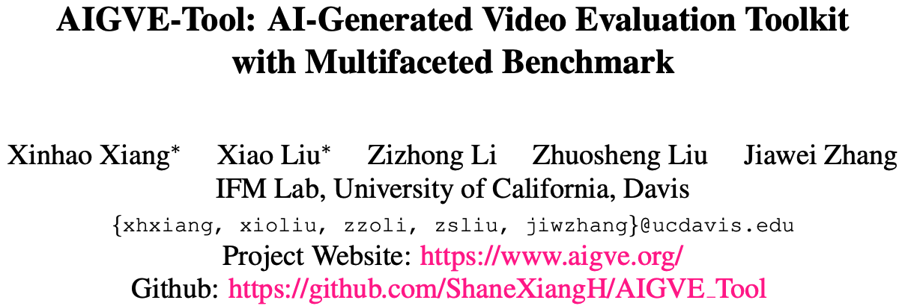
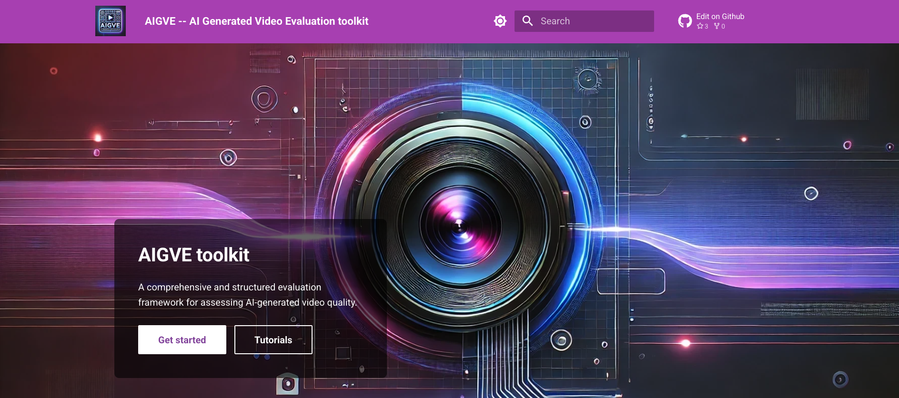

---------------

## 文章标题

### AIGVE-Tool: AI-Generated Video Evaluation Toolkit with Multifaceted Benchmark

## 文章, 网站, 和源码链接

* **Official Website**: [https://www.aigve.org/](https://www.aigve.org/)
* **Github Repository**: [https://github.com/ShaneXiangH/AIGVE_Tool](https://github.com/ShaneXiangH/AIGVE_Tool)
* **PyPI Package**: [https://pypi.org/project/aigve/](https://pypi.org/project/aigve/)
* **AIGVE-Bench Full Dataset** [https://huggingface.co/datasets/xiaoliux/AIGVE-Bench](https://huggingface.co/datasets/xiaoliux/AIGVE-Bench)
* **IFM Lab** [https://www.ifmlab.org/](https://www.ifmlab.org/)

## 背景介绍

近年来，随着 Sora、CogVideoX、Hunyuan 等文本生成视频模型的持续突破，AI 生成视频（AIGV）正迅速成为视频生成领域的前沿方向。此类模型基于自然语言指令生成时序连续的视觉内容，已广泛应用于虚拟内容创作、教育动画、科学可视化等多个场景，展现出强大的跨模态理解与生成能力。

尽管 AIGV 模型本身已取得显著进展，如何对其生成内容的质量进行系统、量化的质量评估（AIGV Evaluation, 即 AIGVE）仍是当前亟待解决的核心问题。
已有研究提出了诸如 FID、IS、CLIPScore、TIFA、VIEScore 等多种 AIGV 自动化质量评估方法，分别从图文一致性、视觉质量、语义匹配、物理合理性等不同角度对生成内容进行打分。
这些方法在各自任务中表现出良好的应用性。然而，当前 AIGV 质量评估研究面临以下三方面挑战：

1. 理论体系缺失：现有 AIGV 质量评估方法往往是为特定模型或评估目标单独设计，缺乏统一的归纳与结构性整理。当前领域尚未形成对 AIGV 质量评估方法的完整分类体系，缺少对评估目标、输入模态、语义层级等核心属性的系统性梳理。这导致研究者在选用 AIGV 质量评估方法时缺乏明确的语义指引，也难以进行多方法组合、跨模型或跨任务的泛化迁移。

2. 工程实现碎片化：现有各评估方法通常作为独立代码实现。它们往往实现分散、接口不统一、预处理步骤不一致，存在大量重复代码与依赖冲突，严重影响了 AIGV 质量评估方法流程的标准化复现与跨研究横向对比的可行性，并进一步限制了 AIGV 的质量评估研究的标准化发展与大规模 benchmark 构建。

3. 缺乏标准数据与对齐机制：目前缺乏高质量、多维度、跨模型、真实人类评分的统一质量评估数据集作为主观评价参照，难以验证评估方法有效性与对比不同方法间的表现，限制了 AIGV 质量评估方法的定量分析与优化空间。

为了解决上述挑战，本文提出 AIGVE-Tool —— 一个统一、模块化、可扩展的 AIGV 质量评估工具包。

首先，AIGVE-Tool 提出了首个结构化的"五类评估方法分类法"。AIGVE-Tool 从"输入模态"、"建模方式"与"语义深度"等角度对已有主流 AIGV 自动化质量评估方法进行了结构化归类，总结出了分布对比类、视频感知类、图文相似性类、图文理解类与多维综合类五大类别。
该分类体系弥补了当前 AIGV 质量评估研究里长期缺失的理论框架，统一了评估方法的分类标准与组织准则。不仅帮助用户从功能角度理解不同 AIGV 质量评估方法之间的联系与差异，也为后续任务适配、评估方法扩展与融合奠定了理论基础。

其次，该 AIGVE-Tool 工具包构建了清晰、可扩展的 AIGV 质量评估执行框架，统一集成了近20个主流 AIGV 质量评估方法。
AIGVE-Tool 基于配置文件驱动、组件解耦的理念，重新组织了 AIGV 质量评估过程中的核心环节，构建了涵盖数据加载、批量评估、整体流程控制的统一执行架构，
AIGVE-Tool 支持快速接入现有或自定义的多模态评估方法，用户可以方便地运行、复用、扩展各种 AIGV 质量评估任务，并与其他 AIGV 质量评估方法进行标准化对比。
AIGVE-Tool 显著提升了 AIGV 质量评估任务实现逻辑的复用性与可维护性，推动 AIGV 质量评估研究的模块化与体系化。

最后，我们配套地构建了大规模人类打分标注的多维度基准数据集 AIGVE-Bench。AIGVE-Bench涵盖五个代表性 AIGV 模型、2430 个视频样本与九个核心质量维度的人类打分（共计 21870 条评分），首次实现了 AIGV 质量评估中自动化评估方法与主观评价在多个维度上的对齐分析。
AIGVE-Bench 提供了全面的评价维度定义、跨模型性能对比与一致性统计图表，是当前结构最完备、维度最全面的 AIGV 质量评估数据集之一。

综合而言，"五类评估方法分类法"为 AIGV 质量评估研究提供了理论支撑, AIGVE-Tool 提供了灵活高效的 AIGV 质量评估系统设计，AIGVE-Bench 则构建了可靠的多维度主观评价数据集。三者协同为 AIGV 质量评估 提供了完整的"理论-架构-数据"解决方案，推动该领域迈向可复现、可扩展、可比较的全新研究范式时代。

## 01. 五类评估方法分类法
随着视频生成模型的不断演化，AIGV 的质量评估任务逐步从"图像级打分"迈向"视频级、多维度、跨模态"的全新阶段。为了帮助用户系统理解这些评估方法的适用范围与能力差异，AIGVE-Tool 在论文中首次提出了"五类评估方法分类体系"，覆盖了从低层感知到高层语义、从单模态特征到跨模态理解的不同评价视角。

我们将目前主流的 AIGV 评估方法根据其设计目标与数据模态，划分为以下五大类：

1. 分布对比类评估方法（Distribution Comparison-Based）：衡量生成视频与真实视频之间在分布层面的相似度。代表方法包括：FID、FVD、IS。

2. 视频感知类评估方法（Video-Only Neural Network-Based）：关注视频的清晰度、连贯性、动态流畅性等主观画面质量。代表方法包括：GSTVQA、SimpleVQA、LightVQA+。

3. 图文相似性类评估方法（Vision-Language Similarity-Based）：使用 CLIP/BLIP 等多模态预训练模型,度量视频 video 与文本提示 prompt 之间的语义一致性。代表方法包括： CLIPScore、BLIPSim、PickScore。

4. 图文理解类评估方法（Vision-Language Understanding-Based）：关注视频 video 与文本提示 prompt 之间的深层理解关系,聚焦事件一致性、问答准确性、动作推理等更复杂语义层面。代表方法包括：TIFA、VIEScore、DSG。

5. 多维综合类评估方法（Multi-Faceted Evaluation）：综合多个评价维度加权融合评估，追求全面反映视频表现。代表方法包括：VideoPhy、VideoScore。

该分类法首次系统性整合了 AIGVE 领域的评估方法，清晰定义了其应用范围、代表方法与功能特性,有助于研究者进行场景选型与组合使用。

为了直观理解五大类评估方法的覆盖范围与差异，下表对 AIGVE-Tool 当前收录的AIGV 自动化质量评估方法进行了分类汇总，并简要介绍其适用功能：

通过该结构化分类，用户可以快速定位各类评估方法的评估目标、使用方式与输入要求。我们的 AIGVE-Tool 根据这个分类来进行组织，为构建用户自定义 AIGV 质量评估任务提供理论支持与工程便利。

## 02. AIGVE-Tool：通用,模块化,可扩展的评估架构

AIGVE-Tool提供了一个基于配置文件驱动的评估系统，核心功能包括:

* 统一的主循环 AIGVELoop：负责标准流程的调度，从数据加载、特征提取、评估方法的计算到结果保存，全部自动执行。

* 灵活的 DataLoader 构建机制：支持不同视频数据格式、任意帧数采样、视频解码器选择、OpenCV / torchvision多后端支持、复杂数据字段处理（如 video+prompt）等。用户可轻松扩展自己的 dataset。

* 模块化的 Evaluator 接口：我们将所有已有的和新的 AIGV 质量评估方法设计为独立模块，用户只需实现标准接口即可接入自定义的评估方法新逻辑。

* 配置文件驱动执行：使用类似 MMEngine 的配置系统，所有设置均通过 Python 配置文件完成，涵盖模型路径、视频输入、评估方法等。避免硬编码，方便组合、继承和快速复用。

下图展示了 AIGVE-Tool 的系统结构：

如上图所示，AIGVE-Tool 框架由三大核心组件构成：配置文件（Configuration Files）、可自定义的数据加载器（Customizable DataLoaders）与模块化的评估方法（Modular Metrics）。它们通过统一主循环 AIGVELoop 串联在一起，完成从数据加载，质量评估，到结果输出的全过程，并支持灵活的 AIGV 质量评估方法扩展与配置替换。该设计基于 MMEngine 实现，强调代码结构清晰与易用性，开发者只需关注组件实现，无需更改主流程逻辑。

基于此架构，当前版本已原生支持包括 FID、IS、FVD、CLIPScore、SimpleVQA、GSTVQA、TIFA、VideoScore 等在内的近 20 个代表性评估方法，涵盖从视觉质量到语义理解的广泛评估任务。接下来我们将分别介绍该架构的每个模块：

### 1. 主循环 AIGVELoop

AIGVELoop 是整个 AIGVE-Tool 框架的执行入口，继承于 MMEngine 的 BaseLoop 构建，具备高度灵活与通用性。它负责串联数据加载器(DataLoader)与评估器（Evaluator），自动调度完整的推理-评估流程。用户无需手动控制每一轮评估逻辑，只需配置好数据加载与方法评估模块即可快速开始实验。AIGVELoop 支持自定义 hooks、FP16 推理、元信息注入等功能，具备良好的扩展性。

### 2. 可自定义的数据加载器（Customizable DataLoaders）

为适应不同 AIGV 模型生成的视频在格式、分辨率、时长等方面的巨大差异，AIGVE-Tool 提供了灵活的支持用户自定义的数据加载模块。该加载模块提供统一接口并兼容多模态输入，支持多种读取后端（如 OpenCV、torchvision）。用户可加载 (video, prompt, meta) 等多字段数据，并进行复杂的数据处理流程。在AIGVE-Tool框架下，用户可以轻松的对视频帧抽样、帧组合方式、视频格式解码、帧数归一化等预处理步骤进行个性化配置，从而实现灵活的数据加载。通过统一封装，配置好的 DataLoader 可在不同评估任务中复用，极大降低了重复代码编写成本。

### 3. 模块化的评估方法（Modular Metrics）

AIGVE-Tool 的评估方法部分被设计为完全模块化结构。每个评估方法作为一个独立模块注册，均继承自 MMEngine 的 BaseMetric。
它们统一遵循 process()和 compute_metrics()两个接口。process() 用于处理单批样本，compute_metrics() 用于计算统计性分数。
无论是传统评估方法（如 FID/FVD），还是大模型驱动的多模态评估方法（如 TIFA、CLIPScore），都可以通过继承抽象基类快速集成。
此设计支持批处理计算、评估维度自定义、多评估方法组合等高级功能，是整个框架的拓展核心。

### 4. 配置驱动执行（Configuration-Driven Execution）

AIGVE-Tool 采用基于 MMEngine 的配置系统，所有组件与参数均通过 .py 配置文件定义。用户可以轻松指定模型路径、评估方法、数据路径、batch size 等运行参数。配置结构清晰，支持模块继承与参数覆盖，适合大规模实验管理。用户无需修改主逻辑，即可快速更换评估方法模块，大幅提升实验效率。

## 03. AIGVE-Bench：多维多模型视频质量评估基准数据集

AIGVE-Bench 是我们在 AIGVE-Tool 框架下设计构建的大规模评估数据集，旨在支持当下及未来 AIGV 多维度、多任务的质量评估研究。
该数据集结合了文本提示、模型输出视频、人类多维评分三大要素，不仅提供统一格式的人类标注，还将自动化质量评估方法结果与人类主观评分进行系统性比对与相关性对齐分析，是当前评价维度最全面、组织结构化程度最高的 AIGV 评估基准之一。
具体来说，AIGVE-Bench 具备以下特点：

### 1. 标注规模庞大

为了确保评估结果的可靠性与泛化性，AIGVE-Bench 采用了大规模人类标注机制。整个数据集中，共计收集 21870 条高质量评分样本，涵盖 2430 个视频，每条视频都在 9 个评价维度上由人工打分完成，构建了多维度、细粒度的主观质量参考标准。

### 2. 文本指令设计丰富

AIGVE-Bench 拥有 500 条高质量文本提示（prompt），广泛涵盖静态场景、动作行为、物理知识、交互关系的多个方面。

下表总结了 AIGVE-Bench 所涵盖的文本提示类别（Instruction Categories），我们从拍摄视角（如全景 vs. 近景）与内容类型（静态对象 vs. 动态类型）两个方面对所有文本提示（prompt）进行了系统分类：

* Global View 类文本提示关注的是大场景与自然地貌，如城市建筑、湖泊山川等，搭配如天气变化、光照切换等自然动态。

* Close Shot 类文本提示则聚焦于单个或多个对象本身（如人物、动物、植物）的局部行为与交互动作。

下图为 AIGVE-Bench 的文本提示（prompt）中每一种"静态对象"（Subjects）与"动态类型"（Dynamics）分布情况：

可见 AIGVE-Bench 的文本提示在静态对象与动态类型中均具备良好多样性，确保了 AIGVE-Bench 数据集在场景复杂度、运动变化、交互性等方面的均衡性，为后续 AIGV 质量评估方法在不同任务上的泛化性测试奠定了基础。

### 3. 数据来源多样
AIGVE-Bench 精选了五个代表性的 SOTA AI视频生成模型: CogVideoX、Genmo、Hunyuan、Pyramid 和 Sora。我们设置统一提示词、采样策略，对每个模型生成的视频进行采集，最终构建了包含 2430 个视频样本 的数据集。

下表列出了由不同模型生成的视频的关键参数，包括分辨率、帧率与时长等，这些参数差异体现了各模型在生成质量、风格以及性能层面的多样性：

这些差异为 AIGV 质量评估方法提出了更高要求——它们不仅要适配不同输出格式，还需具备足够的鲁棒性与广泛性，以实现跨模型的公平对比。

下表展示了使用 AIGVE-Tool 中已集成的 AIGV 自动化质量评估方法，对五个当前 SOTA 视频生成模型进行评估的完整打分结果。表中粗体表示该评估方法下表现最好的模型，方括号内为每个评估方法的取值范围：

从结果可以看出，不同的质量评估方法在不同来源的 AIGV 上各具优势，说明单一的 AIGV 质量评价维度难以全面反映 AI 视频生成模型的综合能力。这也进一步印证了 AIGVE-Bench 多维质量评价体系的重要性。

### 4. 评价维度全面

为了构建具有解释性与通用性的多维度质量评价体系，我们在 AIGVE-Bench 中设定了 9 个细分的评价维度，覆盖从画质、语义一致性、物理合理性到交互与场景复杂度等多个层面。这些维度不仅覆盖了传统图像/视频质量评价中的基础维度，也扩展至 AIGV 独有的跨模态理解与生成能力。每个视频都在这 9 个评价维度上面进行了人工标注评分，构建了标准的主观评价标准。

下表对每个评价维度的具体定义与评估要点进行了详细说明，帮助研究者理解评分标准，同时也为后续设计新的 AIGV 评估方法提供语义支持：

这些评价维度不仅可独立使用，也支持加权融合，支持研究者根据任务需求灵活设计自定义评估方法。

为了更直观地展示不同 AIGV 模型在各评价维度下的表现差异，我们统计了由五个主流生成模型生成的视频在不同静态对象类别（上半部分）和质量评价维度（下半部分）上的人类评分分布情况，如下图所示：

从上图可以看出，不同模型在生成特定类型语义内容（如自然场景 vs. 城市建筑）时表现存在明显差异。例如，一些模型在"自然类对象"（如山脉、动物）上取得了更高的主观评分，而在"人类或城市类对象"上评分相对较低，表明其在细粒度语义表达方面仍存在短板。

下半部分进一步从九个评价维度（如技术质量、物体保真度、交互合理性等）对模型进行细致对比。可以观察到，不同模型在各维度上呈现出不同的强项与弱项。例如，某些模型在语义一致性上表现突出，但在物理规则维度上存在较大不足。

横轴表示对象类别或评价维度，纵轴表示对应模型的平均人类评分，图中 μ 表示均值。整体来看，该图清晰展示了当前主流模型在人类主观评价下的多维度性能特征，是进行细粒度分析与能力诊断的重要依据。

这进一步说明，构建统一的多维评价体系不仅是工程实现的优化手段，更是提升模型理解与分析深度的理论必需。

### 5. 人类评分与自动化评估一致性分析

为了帮助研究者在多个维度间选择最合适的 AIGV 自动化质量评估方法，AIGVE-Bench 进一步分析了各评价维度下的人类评分与各 AIGV 自动化质量评估结果之间的相关性。我们以 Spearman 等级相关系数（SRCC）为衡量指标，分别计算了以下三种相关性表现：

* SRCC₍rand₎：随机生成的分数与人工标签之间的相关性（用于建立无信息基线）；

* SRCC：单一自动化 AIGV 质量评估方法与人工标签的相关性；

* SRCC₍reg₎：通过线性回归融合多种 AIGV 质量评估方法后的评估结果与人工标签之间的相关性。

下表列出了每个评价维度下推荐的最优自动化评估方法及其相关性指标结果：

从结果来看，部分单一方法在特定维度中表现出较高的一致性，而多方法融合策略（SRCC₍reg₎）通常在整体维度上具有更强的拟合能力。
这一发现首次系统性验证了多维融合策略在模拟人类感知质量方面的有效性，为构建统一、可扩展的 AIGV 自动评估体系奠定了坚实基础。

<!--  -->

## 总结与展望

AIGVE-Tool 是首个覆盖主流 AIGV 自动评估方法、支持自定义扩展、搭配高质量多维基准数据的完整工具包。其核心贡献体现在以下三方面：

* 完善理论：提出了首个 AIGV 质量评估方法的结构化分类体系，填补了该领域长期缺乏统一语义框架的空白；

* 统一架构：构建了基于配置驱动的评估框架，支持模块解耦与灵活组合，显著提升评估任务的可复用性与可扩展性；

* 构建数据：创建了大规模多维度主观评价基准 AIGVE-Bench，首次实现主观评分与主流自动化评估方法之间的系统对齐与量化分析，为评估方法效果验证提供可靠支撑。

我们期望 AIGVE-Tool 能够为开发者提供快速验证模型性能的实验平台，也为学术研究提供统一、公平、可复现的评估标准，助力 AIGV 研究迈向更高层次的系统化与标准化。

展望未来，我们将持续迭代更新集成更多 AIGV 质量评估方法与评价维度，推动构建更具普适性与覆盖性的 AIGV 质量评估体系。同时，我们也诚挚欢迎广大研究者、工程师、开发者与学生加入，共建共享 AIGVE 生态，共同推动多模态生成质量评估迈向新阶段！

## `aigve`工具包与项目网站介绍

为了便于用户快速上手使用 AIGVE-Tool，我们同步发布了完整的开源代码仓库、安装包发布平台，以及配套的项目官网与使用文档。

### 源码仓库与 PyPI 安装地址

`aigve` 工具包已经在 GitHub 与 PyPI 平台上线，支持一键安装与本地部署：

* **Github Repository**: [https://github.com/ShaneXiangH/AIGVE_Tool](https://github.com/ShaneXiangH/AIGVE_Tool) , 包含完整的框架源码、评估方法实现、配置示例与数据预处理脚本。
* **PyPI Package**: [https://pypi.org/project/aigve/](https://pypi.org/project/aigve/) , 支持使用 `pip install aigve` 快速安装。

我们建议开发者通过 GitHub 获取最新源码版本，方便查阅评估方法实现与提交 Issue。

### 官方项目网站
为了提供更友好的使用体验，我们专门搭建了 AIGVE 项目官网，网站中包含了完整的组件说明、配置示例、常见问题答疑与使用教程等内容。网站链接和部分网站页面如下所示：

* Official Website: [https://www.aigve.org/](https://www.aigve.org/)

#### 网站主页

#### 文档目录

#### Tutorial 列表

如有问题，欢迎通过 GitHub Issue 留言交流，或参与贡献更多评估方法与数据集支持。我们将持续迭代文档与功能，提升 AIGV 质量评估的工程便利性与社区友好度。